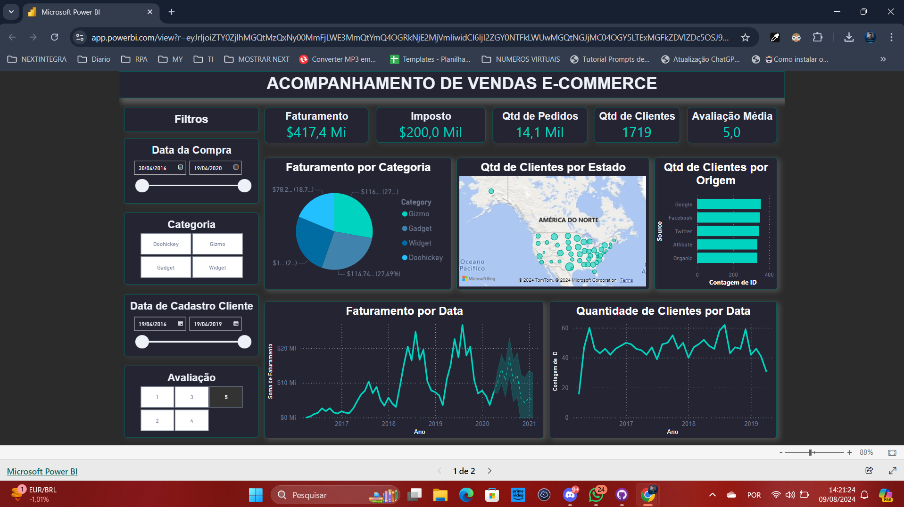
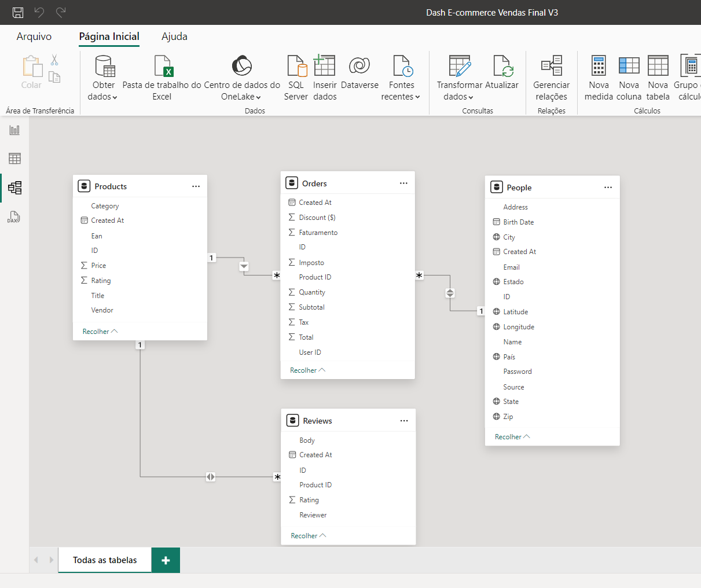

# Projeto de Análise de Vendas em E-commerce com Power BI - Escola DNC

Este repositório contém todos os arquivos e documentação relacionados ao meu projeto de análise de vendas em e-commerce desenvolvido durante o curso na Escola DNC. Este projeto utilizou o Power BI para transformar dados brutos em insights valiosos.

- **Projeto Final Online:** <a href="https://app.powerbi.com/view?r=eyJrIjoiZTY0ZjlhMGQtMzQxNy00MmFjLWE3MmQtYmQ4OGRkNjE2MjVmIiwidCI6IjI2ZGY0NTFkLWUwMGQtNGJjMC04OGY5LTExMGFkZDVlZDc5OSJ9&pageName=5a6908baa7877b565312" target="_blank">Clique aqui!</a>

<iframe title="Dash E-commerce Vendas Final V3" width="800" height="486" src="https://app.powerbi.com/view?r=eyJrIjoiZTY0ZjlhMGQtMzQxNy00MmFjLWE3MmQtYmQ4OGRkNjE2MjVmIiwidCI6IjI2ZGY0NTFkLWUwMGQtNGJjMC04OGY5LTExMGFkZDVlZDc5OSJ9&pageName=5a6908baa7877b565312" frameborder="0" allowFullScreen="true"></iframe>

## Sumário
1. [Introdução](#introdução)
2. [Dados Brutos](#dados-brutos)
3. [Levantamento de Requisitos](#levantamento-de-requisitos)
4. [Processamento e Tratamento dos Dados](#processamento-e-tratamento-dos-dados)
5. [Criação do Dashboard - Versão 1](#criação-do-dashboard---versão-1)
6. [Criação do Dashboard - Versão 2](#criação-do-dashboard---versão-2)
7. [Aprimoramentos e Versão Final do Dashboard](#aprimoramentos-e-versão-final-do-dashboard)
8. [Relacionamentos entre Tabelas](#relacionamentos-entre-tabelas)
9. [Ferramentas Utilizadas](#ferramentas-utilizadas)
10. [Conclusão](#conclusão)
11. [Contribuição](#contribuição)

## Introdução
Este projeto tem como objetivo demonstrar a aplicação prática de habilidades em análise de dados utilizando o Power BI. O projeto envolve a coleta, tratamento e análise de dados de vendas, utilizando tabelas dinâmicas e gráficos para obter insights valiosos.

## Dados Brutos
Os dados brutos utilizados neste projeto foram recebidos em formato CSV e estão disponíveis neste repositório:
- [Datasets](./assets/dados-brutos/)

## Levantamento de Requisitos

O levantamento de requisitos foi realizado para identificar os principais indicadores de performance necessários para a análise. Abaixo está listado os principais requisitos e levantamentos feitos.

### Objetivos Gerais

- **Faturamento e Quantidade de Pedidos**
  - Saber faturamento e quantidade de pedidos por tempo, produto e categoria.
  - Identificar produtos e categorias mais vendidos.

- **Top e Bottom Produtos por Faturamento**
  - Determinar os 10 produtos mais vendidos e menos vendidos.
  - Focar nos produtos campeões de vendas e remover produtos com baixo desempenho.

- **Avaliação dos Produtos**
  - Analisar avaliações dos produtos pelos clientes.
  - Identificar produtos mais bem avaliados e com avaliações negativas para melhoria ou remoção.

### Tabela Clientes

- **Localização dos Clientes**
  - Identificar cidades ou estados com maior concentração de clientes para facilitar vendas e otimizar campanhas de marketing.
  - Explorar novas regiões para expansão com custo de aquisição potencialmente menor.

- **Origem dos Clientes**
  - Identificar origem dos clientes para direcionar campanhas de marketing.

- **Aquisição de Clientes ao Longo do Tempo**
  - Monitorar quantidade de clientes novos ao longo do tempo.
  - Avaliar a eficácia das estratégias de aquisição de clientes e buscar melhorias.

### Poder de Decisão para Gestores

- **Análise de Resultados**
  - Permitir que gestores filtrem por categoria, produto e período para análise contínua.
  - Facilitar respostas a perguntas frequentes sobre desempenho de vendas, avaliações de clientes, etc.

### Diferença entre Análise de Dados Pontual e Contínua

- **Análise de Dados Pontual**
  - Realizada para responder a perguntas raras e específicas utilizando Excel.
  
- **Análise de Dados Contínua**
  - Necessidade de criação de dashboards para permitir aos gestores tomarem decisões baseadas em dados em tempo real.

### Conclusão

Este levantamento de requisitos visa criar um dashboard interativo que permita aos gestores obter insights valiosos e tomar decisões informadas para melhorar o desempenho do e-commerce.

## Processamento e Tratamento dos Dados
Os dados brutos foram processados e tratados na Power Query, garantindo a limpeza e a preparação dos dados para análise. A planilha com os dados tratados pode ser encontrada aqui:
- [Dados Tratados Final](./assets/dados-tratados/Dados%20tratados%20final.xlsx)

## Criação do Dashboard - Versão 1
A primeira versão do dashboard foi criada seguindo as orientações do módulo do curso. Esta versão inicial está disponível em formato PDF:
- [Dashboard Versão 1](./assets/pdf/Dashboard%20de%20Vendas%20Final%20V1.pdf)

## Criação do Dashboard - Versão 2
A segunda versão do dashboard foi criada seguindo as orientações do módulo do curso. Esta versão inicia uma modificação de layout disponível em formato PDF:
- [Dashboard Versão 2](./assets/pdf/Dash%20E-commerce%20Vendas%20Final%20V2.pdf)

## Aprimoramentos e Versão Final do Dashboard
Com base no feedback e nas revisões, foram realizados aprimoramentos e ajustes para criar a versão final do dashboard. A versão final pode ser encontrada em formato PDF:
- [Dashboard Versão Final (V3)](./assets/pdf/Dash%20E-commerce%20Vendas%20Final%20V3.pdf)

## Relacionamentos entre Tabelas
Os relacionamentos entre as tabelas foram definidos para garantir a integridade e a coerência dos dados. A imagem abaixo mostra os relacionamentos entre as tabelas:

## Ferramentas Utilizadas
- **Power BI**: Para toda a visualização e análise de dados.
- **Power Query**: Para transformação e limpeza dos dados.

## Conclusão
Este projeto foi uma excelente oportunidade para aplicar os conhecimentos adquiridos e desenvolver habilidades práticas em análise de dados. Agradeço à Escola DNC pelo apoio e aprendizado!

## Contribuição
Contribuições são bem-vindas! Siga os passos abaixo para contribuir:

1. Faça um fork do projeto.
2. Crie uma branch para sua feature (git checkout -b feature/nova-feature).
3. Commit suas mudanças (git commit -m 'Adiciona nova feature').
4. Faça um push para a branch (git push origin feature/nova-feature).
5. Abra um Pull Request.

## Licença
Este projeto está licenciado sob a Licença MIT. Veja o arquivo LICENSE para mais detalhes.

## Contato
Para mais informações, entre em contato:

- **Nome:** Leonardo Alves da Cunha
- **Email:** leonardoallves1992@gmail.com
- **LinkedIn:** https://www.linkedin.com/in/leo-cunha-allves/ 
